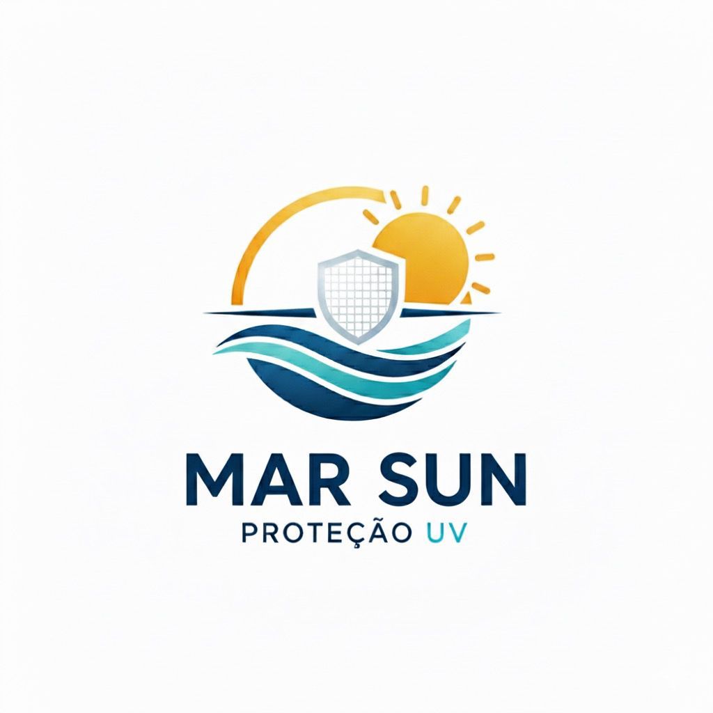

# 🌊 Mar Sun - Proteção que acompanha sua aventura



## Sobre a Mar Sun

A **Mar Sun** é uma marca brasileira especializada em camisetas com proteção UV 50+, desenvolvidas para acompanhar você em todos os momentos da sua vida. Do mar à montanha, dos esportes radicais aos passeios em família, nossas camisetas combinam tecnologia de ponta, design moderno e conforto incomparável.

### 🎯 Slogan

**"Proteção que acompanha sua aventura"**

### 💡 Nossa Missão

Proporcionar proteção solar de alta qualidade sem abrir mão do estilo, permitindo que você aproveite cada momento ao ar livre com segurança e confiança.

## ✨ Características dos Produtos

### 🛡️ Proteção UV 50+

Máxima proteção contra raios solares nocivos, certificada e testada.

### 👕 Tecido Premium

- Conforto superior
- Durabilidade excepcional
- Respirável e leve
- Tecnologia de secagem rápida

### 💧 Secagem Rápida

Perfeito para atividades aquáticas e esportes intensos.

### 🌿 Sustentabilidade

Comprometidos com processos de produção sustentáveis e responsáveis.

## 🏷️ Categorias de Produtos

### 🏖️ Praia

Camisetas UV desenvolvidas para dias de sol e mar, com design casual e proteção máxima.

**Produtos:**

- Camiseta UV Praia Premium - R$ 129,90
- Camiseta UV Praia Feminina - R$ 119,90
- Camiseta UV Casual Verão - R$ 109,90

### ⚽ Esportes

Linha performance para treinos ao ar livre e atividades físicas intensas.

**Produtos:**

- Camiseta UV Sport Performance - R$ 139,90
- Camiseta UV Surf Pro - R$ 159,90
- Camiseta UV Performance Elite - R$ 169,90

### ⛰️ Montanha

Desenvolvidas para aventuras em trilhas, montanhismo e outdoor.

**Produtos:**

- Camiseta UV Aventura - R$ 149,90

### 👶 Infantil

Proteção e diversão para os pequenos aventureiros.

**Produtos:**

- Camiseta UV Kids Colorida - R$ 99,90

## 🌐 Website

### Funcionalidades

- ✅ Catálogo completo de produtos
- ✅ Sistema de carrinho de compras
- ✅ Filtros por categoria
- ✅ Design responsivo (mobile-first)
- ✅ Galeria de lifestyle
- ✅ Newsletter
- ✅ Formulário de contato
- ✅ Persistência de carrinho (localStorage)

### Tecnologias Utilizadas

- HTML5
- CSS3 (Design moderno e responsivo)
- JavaScript (Vanilla JS)
- Font Awesome (Ícones)
- Google Fonts (Poppins & Montserrat)

### Estrutura do Projeto

```
marsun/
├── index.html          # Página principal
├── css/
│   └── style.css      # Estilos do site
├── js/
│   └── script.js      # Funcionalidades JavaScript
├── imagens/           # Imagens dos produtos e logo
└── README.md          # Este arquivo
```

## 🎨 Paleta de Cores

- **Primary Color:** #0096c7 (Azul Mar)
- **Primary Dark:** #0077b6 (Azul Escuro)
- **Secondary Color:** #48cae4 (Azul Claro)
- **Accent Color:** #f77f00 (Laranja)
- **Dark Color:** #023047 (Azul Marinho)
- **Light Color:** #f8f9fa (Cinza Claro)

## 🚀 Como Usar

1. Abra o arquivo `index.html` em seu navegador
2. Navegue pelas seções do site
3. Explore os produtos por categoria
4. Adicione produtos ao carrinho
5. Finalize sua compra (demo)

## 📱 Seções do Site

1. **Hero Section** - Apresentação da marca com call-to-action
2. **Features** - Características principais dos produtos
3. **Sobre** - História e missão da Mar Sun
4. **Produtos** - Catálogo completo com filtros
5. **Lifestyle** - Galeria de fotos em ação
6. **Newsletter** - Inscrição para novidades
7. **Contato** - Formulário e informações de contato

## 💼 Valores da Marca

✅ **Qualidade Garantida** - Produtos testados e certificados
✅ **Design Exclusivo** - Estilo brasileiro único
✅ **Proteção Comprovada** - UV 50+ certificado

## 📞 Contato

- **E-mail:** contato@marsun.com.br
- **Telefone:** (11) 99999-9999
- **Localização:** São Paulo, SP - Brasil

### Redes Sociais

- Instagram: @marsunbrasil
- Facebook: /marsunoficial
- WhatsApp: (11) 99999-9999

## 📄 Política de Vendas

- 🔒 Ambiente seguro de compras
- 💳 Diversas formas de pagamento (Visa, Mastercard, PayPal, PIX)
- 🚚 Entrega para todo Brasil
- ↩️ Política de trocas e devoluções facilitada
- 🎁 Embalagem especial para presente

## 🌟 Diferenciais

1. **Tecnologia UV 50+** - Bloqueio de 98% dos raios UVA/UVB
2. **Conforto Térmico** - Tecido respirável que não esquenta
3. **Secagem Ultra Rápida** - Ideal para esportes aquáticos
4. **Durabilidade** - Mantém proteção mesmo após várias lavagens
5. **Design Brasileiro** - Estampas e cores tropicais exclusivas

## 🎯 Público Alvo

- Surfistas e praticantes de esportes aquáticos
- Aventureiros e trilheiros
- Famílias que valorizam proteção solar
- Atletas outdoor
- Pessoas com pele sensível ao sol
- Pais preocupados com a proteção dos filhos

---

**Mar Sun** - Sua proteção solar com estilo brasileiro! 🇧🇷☀️🌊

_Desenvolvido com 💙 para quem ama aventuras ao ar livre_
